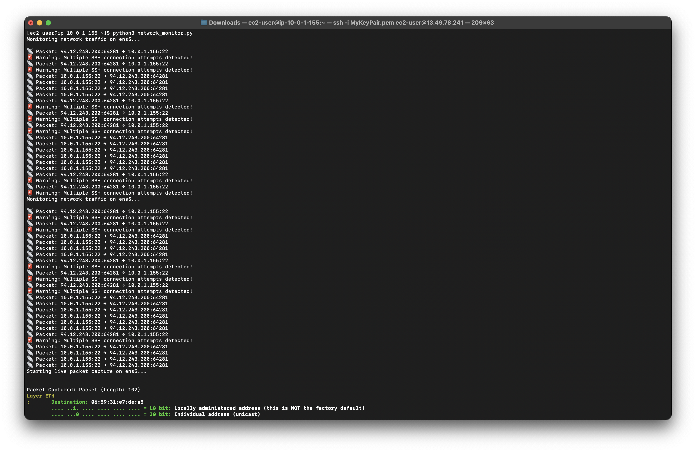
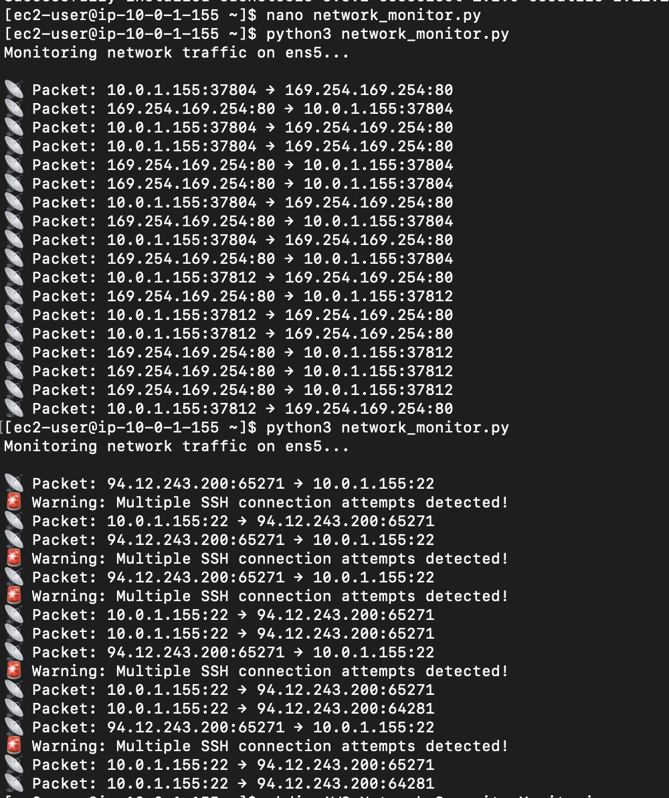
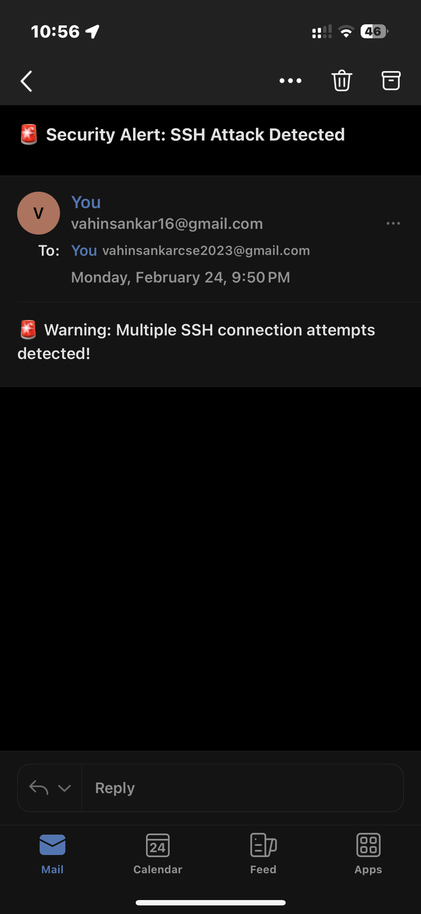

# 🚀 AWS Network Security Monitoring  

### 📡 Real-Time Network Traffic Analysis & Security Alerts with Python, TShark & AWS EC2  

## 🔹 Overview  
This project automates **network security monitoring** by:  
✅ Capturing real-time network traffic using **TShark**  
✅ Detecting **suspicious activity (e.g., SSH brute-force attacks)**  
✅ Logging network traffic for future analysis  
✅ Sending **email alerts** for security threats  

---

## 🔹 Technologies Used  
- 🖥️ **AWS EC2** (Ubuntu/ Amazon Linux 2023)  
- 📡 **TShark** (Packet capture tool)  
- 🐍 **Python** (PyShark, Yagmail)  
- 📬 **SMTP Email Alerts**  
- 🔍 **Fail2Ban** (SSH brute-force protection)  
- 📝 **Logging for analysis**  

---

## 🔹 Project Structure  
📂 AWS-Network-Security-Monitoring

├── 📄 network_monitor.py # Python script for real-time monitoring & alerts

├── 📄 network_alerts.log # Log file storing network activity

├── 📄 README.md # Project documentation

├── 📁 screenshots/ # Screenshots for documentation

---

## 🔹 Screenshots  
### 1️⃣ Network Traffic Captured in Real-Time  
📌 **This shows live network packets being captured.**  
  

### 2️⃣ SSH Brute-Force Detection Alert  
📌 **Detecting multiple SSH connection attempts and raising alerts.**  
  

### 3️⃣ Email Alert Sent on Threat Detection  
📌 **Email alert notification for suspicious activity.**  
  
 

---

## 🔹 Installation & Setup  
### 1️⃣ Clone the Repository  
```bash
git clone https://github.com/your-username/AWS-Network-Security-Monitoring.git
cd AWS-Network-Security-Monitoring
```
### 2️⃣ Install Required Packages
```bash
sudo yum install -y wireshark nmap fail2ban  
pip3 install scapy pyshark yagmail
```
### 3️⃣ Run the Monitoring Script
```bash
python3 network_monitor.py
```
### 4️⃣ Trigger an SSH Attack (for testing)
```bash
ssh -i WrongKey.pem ec2-user@your-ec2-public-ip
```
📬 Check your email for alerts!

## 🔹 How It Works

### 1️⃣ Network Packet Capture:

The script continuously monitors network traffic on ens5 interface.
Uses TShark to capture incoming/outgoing packets.

### 2️⃣ SSH Brute-Force Attack Detection:

Detects repeated SSH login attempts from the same IP.
Raises an alert if too many failed attempts.

### 3️⃣ Automated Email Alert System:

If a threat is detected, an email is sent with alert details.

### 4️⃣ Logging & Analysis:

Logs all network activity to network_alerts.log for further investigation.

## 🔹 Future Enhancements

🚀 Integrate Kibana/Grafana for real-time traffic visualization
🚀 Expand monitoring to detect port scanning & DDoS attacks
🚀 Automate log analysis with AI/ML models

## 🔹 Contributing

Pull requests are welcome! If you'd like to contribute, please fork the repository and submit a PR.

🔗 Check out the full project: [GitHub Repository](https://github.com/vahin-git/AWS-Network-Security-Monitoring)


📢 Let's connect! Drop your thoughts or feedback.


#CyberSecurity #CloudSecurity #AWS #Python #Automation #NetworkSecurity
